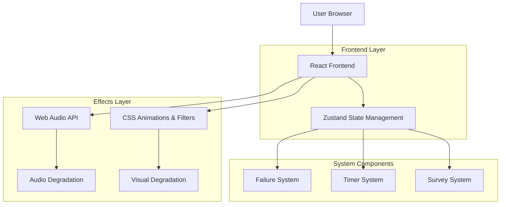

# Documento Técnico - Arte Digital Interactivo: Obsolescencia Programada

## 1. Descripción General

### Objetivo Artístico
Explorar la obsolescencia programada a través de una experiencia digital interactiva que simula el deterioro progresivo de la tecnología mientras el usuario intenta completar una tarea simple por una recompensa que nunca llegará.

### Concepto Central
Página web que se deteriora progresivamente mientras el usuario intenta completar una encuesta por una recompensa de 10 soles. La experiencia combina elementos visuales, sonoros y performativos para crear una crítica al consumismo tecnológico.

### Formato
Net Sound Art con elementos visuales, sonoros y performativos que evolucionan en tiempo real.

## 2. Arquitectura Técnica

### 2.1 Stack Tecnológico


### 2.2 Tecnologías Específicas
- **Frontend**: React@18 + TypeScript + Vite
- **Estilos**: Tailwind CSS@3 + CSS Custom Properties
- **Gestión de Estado**: Zustand
- **Audio**: Web Audio API + Howler.js (opcional para mejor compatibilidad)
- **Animaciones**: Framer Motion (opcional para animaciones complejas)
- **Tipografía**: Fuentes que simulen degradación con el tiempo

## 3. Definición de Rutas

| Ruta | Propósito |
|------|-----------|
| / | Página principal con la encuesta y el temporizador |
| /reward | Página simulada de reclamo de recompensa (nunca accesible) |
| /update | Página falsa de actualización del sistema |
| /error | Página de error simulada |

## 4. Modelo de Datos y Estado

### 4.1 Estado Global (Zustand)
```typescript
interface AppState {
  // Timer and degradation
  timeElapsed: number;
  degradationLevel: number; // 0-100
  isActive: boolean;
  
  // Survey progress
  surveyProgress: number;
  surveyCompleted: boolean;
  
  // Failure system
  activeFailures: Failure[];
  totalFailures: number;
  
  // Audio state
  audioContext: AudioContext | null;
  distortionLevel: number;
  
  // Visual state
  visualCorruption: number;
  glitchIntensity: number;
}

interface Failure {
  id: string;
  type: 'button' | 'input' | 'audio' | 'visual' | 'navigation';
  severity: number; // 1-10
  active: boolean;
  timestamp: number;
}
```

### 4.2 Puntos de Fallo
```typescript
const FAILURE_POINTS = [
  { time: 5000, failures: ['button_delay'] },
  { time: 10000, failures: ['audio_distortion', 'visual_glitch'] },
  { time: 15000, failures: ['input_lag', 'button_unresponsive'] },
  { time: 25000, failures: ['screen_flicker', 'audio_cuts'] },
  { time: 35000, failures: ['navigation_block', 'survey_corruption'] },
  { time: 45000, failures: ['total_breakdown'] }
];
```

## 5. Componentes Principales

### 5.1 TimerComponent
**Propósito**: Maneja el temporizador con degradación progresiva
**Estado local**: 
- tiempo restante
- nivel de degradación
- fallos activos

**Efectos secundarios**:
- Aumenta nivel de degradación global
- Activa fallos según tiempo transcurrido
- Modifica velocidad del temporizador

### 5.2 SurveyComponent
**Propósito**: Encuesta con fallos progresivos
**Características**:
- Preguntas que se corrompen con el tiempo
- Botones que fallan aleatoriamente
- Inputs que pierden precisión
- Validaciones que cambian

### 5.3 AudioManager
**Propósito**: Control de audio con distorsión
**Técnicas**:
- Web Audio API para distorsión real
- Filtros Biquad
- Delay y reverb
- Pitch shifting
- Cortes aleatorios

### 5.4 FailureSystem
**Propósito**: Sistema de fallos aleatorios
**Mecánicas**:
- Pool de fallos disponibles
- Activación basada en tiempo
- Intensidad progresiva
- Recuperación falsa

### 5.5 VisualDegradation
**Propósito**: Efectos visuales de deterioro
**Técnicas CSS**:
```css
.degradation-effects {
  filter: contrast(120%) brightness(90%) saturate(80%);
  transform: skew(0.5deg, 0.2deg);
  opacity: 0.95;
}

.glitch-effect {
  animation: glitch 0.3s infinite;
}

@keyframes glitch {
  0% { transform: translate(0); }
  20% { transform: translate(-2px, 2px); }
  40% { transform: translate(-2px, -2px); }
  60% { transform: translate(2px, 2px); }
  80% { transform: translate(2px, -2px); }
  100% { transform: translate(0); }
}
```

## 6. Sistema de Degradación Progresiva

### 6.1 Fases de Degradación
1. **Fase 1 (0-10s)**: Funcionamiento aparentemente normal
2. **Fase 2 (10-20s)**: Pequeños retrasos y distorsiones menores
3. **Fase 3 (20-30s)**: Fallos notables en UI y audio
4. **Fase 4 (30-40s)**: Corrupción significativa
5. **Fase 5 (40s+)**: Colapso total de funcionalidad

### 6.2 Mecánicas de Fallo
- **Fallos de Botón**: Delay, doble clic necesario, texto cambiado
- **Fallos de Input**: Caracteres perdidos, autocorrección errónea
- **Fallos Visuales**: Glitches, parpadeo, colores invertidos
- **Fallos de Audio**: Distorsión, cortes, volumen variable
- **Fallos de Navegación**: Links rotos, redirecciones falsas

## 7. Implementación de Audio

### 7.1 Web Audio API Setup
```typescript
class AudioDegradation {
  private context: AudioContext;
  private distortion: WaveShaperNode;
  private delay: DelayNode;
  
  initialize() {
    this.context = new AudioContext();
    this.distortion = this.context.createWaveShaper();
    this.delay = this.context.createDelay();
  }
  
  applyDegradation(level: number) {
    // Aplicar distorsión basada en nivel
    this.distortion.curve = this.makeDistortionCurve(level * 100);
    this.delay.delayTime.value = level * 0.1;
  }
}
```

### 7.2 Efectos de Audio
- **Distorsión**: WaveShaperNode con curva personalizada
- **Delay**: DelayNode con feedback
- **Filtros**: BiquadFilterNode para simular daño
- **Pitch**: Detune de audio buffers
- **Glitch**: Cortes aleatorios con GainNode

## 8. Mensajes y Engaños

### 8.1 Mensajes de Actualización Simulados
```typescript
const FAKE_MESSAGES = [
  "Actualizando sistema... 15%",
  "Reparando errores de conexión...",
  "Optimizando rendimiento...",
  "Instalando parches de seguridad...",
  "Reiniciando servicios..."
];
```

### 8.2 Promesas de Recompensa
- Barra de progreso que nunca llega al 100%
- Mensajes de "casi listo"
- Recompensa que "se está procesando"
- Errores de "sistema" que reinician el progreso

## 9. Consideraciones de Performance

### 9.1 Optimización de Efectos Visuales
- Usar CSS transforms en lugar de position changes
- Implementar will-change para elementos animados
- Limitar el número de efectos simultáneos
- Usar requestAnimationFrame para animaciones complejas

### 9.2 Gestión de Memoria
- Limpiar event listeners de fallos
- Destruir nodos de audio cuando no se usen
- Limitar el historial de estados degradados
- Implementar pooling para efectos frecuentes

## 10. Aspectos Artísticos y Conceptuales

### 10.1 Net Sound Art
- Integración de elementos sonoros y visuales en tiempo real
- La página actúa como un instrumento musical que se desafina
- Feedback loop entre acción del usuario y degradación

### 10.2 Performatividad
- La página como objeto vivo que envejece
- El usuario como performer involuntario
- El tiempo como elemento coreográfico

### 10.3 Crítica Social
- Obsolescencia programada como performance
- La frustración como forma de concienciación
- El engaño tecnológico como espejo del consumismo

## 11. Testing y Debugging

### 11.1 Testing de Fallos
```typescript
// Test de degradación acelerada
const testDegradation = () => {
  const store = useAppStore();
  store.setTimeElapsed(30000); // Saltar a 30s
  store.setDegradationLevel(60);
  // Verificar que los fallos correspondientes se activan
};
```

### 11.2 Debugging de Efectos
- Modo "debug" que muestra nivel de degradación
- Controles manuales para activar fallos específicos
- Visualización de estado de cada sistema

## 12. Deployment y Performance

### 12.1 Build Optimization
- Code splitting para cargar efectos bajo demanda
- Optimización de imágenes y assets
- Minificación de CSS personalizado
- Compresión de archivos de audio

### 12.2 Browser Compatibility
- Polyfills para Web Audio API
- Fallbacks para CSS filters antiguos
- Detección de capacidades del navegador
- Mensajes de error graceful para navegadores no soportados

## 13. Métricas y Análisis

### 13.1 Métricas de Experiencia
- Tiempo promedio antes de abandonar
- Número de intentos de completar la encuesta
- Interacciones con elementos fallados
- Respuesta a mensajes de actualización

### 13.2 Datos Anónimos de Uso
- Patrones de degradación más efectivos
- Momentos de mayor frustración
- Tipos de fallo más convincentes
- Engagement con diferentes fases

## 14. Conclusiones Técnicas

Este sistema técnico permite crear una experiencia artística inmersiva que critica la obsolescencia programada mediante la simulación de fallos tecnológicos progresivos. La combinación de React, Web Audio API, y técnicas visuales avanzadas permite crear una performance digital donde el usuario experimenta firsthand la frustración de la tecnología que falla deliberadamente.

El éxito del proyecto radica en el balance entre funcionalidad aparente y degradación progresiva, manteniendo al usuario enganchado mientras la experiencia se vuelve progresivamente más frustrante, creando así una crítica poderosa al consumismo tecnológico contemporáneo.